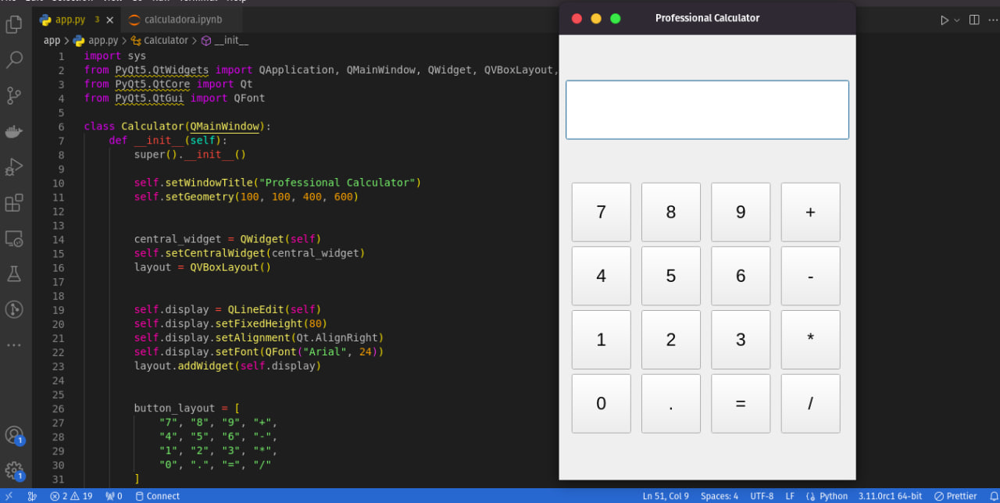

# Calculadora Profissional em Python

Esta é uma calculadora profissional em Python com uma interface gráfica moderna, desenvolvida usando a biblioteca PyQt5.

## Recursos

- Interface gráfica moderna e agradável.
- Suporte para operações matemáticas básicas (adição, subtração, multiplicação, divisão).
- Exibe resultados em tempo real à medida que você insere as operações.
- Lida com erros de entrada e exibe "Erro" se uma expressão não puder ser avaliada.
- Interface de usuário intuitiva com botões para números e operações.
- Funciona em qualquer sistema operacional com suporte para PyQt5.

## Pré-requisitos

- Python 3.x
- PyQt5 (você pode instalá-lo com `pip install PyQt5`)

## Como usar

1. Clone o repositório ou baixe o código-fonte.

2. Certifique-se de que você tenha Python 3.x e o PyQt5 instalados em seu ambiente.

3. Execute o arquivo `app.py` para iniciar a calculadora.

4. Use os botões numéricos e operadores para realizar cálculos.

5. Pressione "Enter" ou "=" para calcular o resultado.

6. Aproveite sua calculadora profissional!

## Contribuindo

Sinta-se à vontade para contribuir para este projeto aberto. Você pode relatar problemas, sugerir melhorias ou enviar solicitações de pull.

## Licença

Este projeto está licenciado sob a Licença MIT - consulte o arquivo [LICENSE](LICENSE) para obter detalhes.

---
Desenvolvido por [Felipe Castro](https://github.com/castroofelipee)
